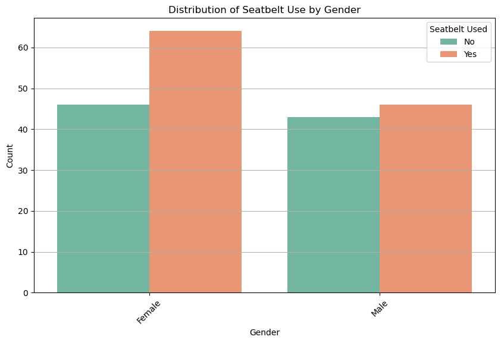

## Assignment 3: Baby Project

We are looking at Road Accident Survival data from Kaggle: https://www.kaggle.com/datasets/himelsarder/road-accident-survival-dataset?resource=download


```python
import pandas as pd
import matplotlib.pyplot as plt
import seaborn as sns

%matplotlib inline


file_path = ('C:/Users/hdbd1/Downloads/archive/accident.csv')
df = pd.read_csv(file_path)
print("done")
```

    done
    

### Summary


```python
print("there are ",df.shape[0], " rows")
print("there are ",df.shape[1], " columns")
```

    there are  200  rows
    there are  6  columns
    


```python
df.describe(include = "all").round(2)
```


<div>
<style scoped>
    .dataframe tbody tr th:only-of-type {
        vertical-align: middle;
    }

    .dataframe tbody tr th {
        vertical-align: top;
    }

    .dataframe thead th {
        text-align: right;
    }
</style>
<table border="1" class="dataframe">
  <thead>
    <tr style="text-align: right;">
      <th></th>
      <th>Age</th>
      <th>Gender</th>
      <th>Speed_of_Impact</th>
      <th>Helmet_Used</th>
      <th>Seatbelt_Used</th>
      <th>Survived</th>
    </tr>
  </thead>
  <tbody>
    <tr>
      <th>count</th>
      <td>200.00</td>
      <td>199</td>
      <td>197.00</td>
      <td>200</td>
      <td>200</td>
      <td>200.0</td>
    </tr>
    <tr>
      <th>unique</th>
      <td>NaN</td>
      <td>2</td>
      <td>NaN</td>
      <td>2</td>
      <td>2</td>
      <td>NaN</td>
    </tr>
    <tr>
      <th>top</th>
      <td>NaN</td>
      <td>Female</td>
      <td>NaN</td>
      <td>Yes</td>
      <td>Yes</td>
      <td>NaN</td>
    </tr>
    <tr>
      <th>freq</th>
      <td>NaN</td>
      <td>110</td>
      <td>NaN</td>
      <td>111</td>
      <td>111</td>
      <td>NaN</td>
    </tr>
    <tr>
      <th>mean</th>
      <td>43.42</td>
      <td>NaN</td>
      <td>70.44</td>
      <td>NaN</td>
      <td>NaN</td>
      <td>0.5</td>
    </tr>
    <tr>
      <th>std</th>
      <td>14.94</td>
      <td>NaN</td>
      <td>30.13</td>
      <td>NaN</td>
      <td>NaN</td>
      <td>0.5</td>
    </tr>
    <tr>
      <th>min</th>
      <td>18.00</td>
      <td>NaN</td>
      <td>20.00</td>
      <td>NaN</td>
      <td>NaN</td>
      <td>0.0</td>
    </tr>
    <tr>
      <th>25%</th>
      <td>31.00</td>
      <td>NaN</td>
      <td>43.00</td>
      <td>NaN</td>
      <td>NaN</td>
      <td>0.0</td>
    </tr>
    <tr>
      <th>50%</th>
      <td>43.50</td>
      <td>NaN</td>
      <td>71.00</td>
      <td>NaN</td>
      <td>NaN</td>
      <td>1.0</td>
    </tr>
    <tr>
      <th>75%</th>
      <td>56.00</td>
      <td>NaN</td>
      <td>95.00</td>
      <td>NaN</td>
      <td>NaN</td>
      <td>1.0</td>
    </tr>
    <tr>
      <th>max</th>
      <td>69.00</td>
      <td>NaN</td>
      <td>119.00</td>
      <td>NaN</td>
      <td>NaN</td>
      <td>1.0</td>
    </tr>
  </tbody>
</table>
</div>


What the data looks like at the top and bottom


```python
print(df.head(7))
print(df.tail(7))
```

       Age  Gender  Speed_of_Impact Helmet_Used Seatbelt_Used  Survived
    0   56  Female             27.0          No            No         1
    1   69  Female             46.0          No           Yes         1
    2   46    Male             46.0         Yes           Yes         0
    3   32    Male            117.0          No           Yes         0
    4   60  Female             40.0         Yes           Yes         0
    5   25    Male             49.0         Yes           Yes         1
    6   38    Male            116.0         Yes           Yes         1
         Age  Gender  Speed_of_Impact Helmet_Used Seatbelt_Used  Survived
    193   18  Female             99.0         Yes            No         0
    194   44  Female             21.0          No           Yes         0
    195   69  Female            111.0          No           Yes         1
    196   30  Female             51.0          No           Yes         1
    197   58    Male            110.0          No           Yes         1
    198   20    Male            103.0          No           Yes         1
    199   56  Female             43.0          No           Yes         1
    


```python
df.isna().sum()
```


    Age                0
    Gender             1
    Speed_of_Impact    3
    Helmet_Used        0
    Seatbelt_Used      0
    Survived           0
    dtype: int64


Are there any completely empty rows?


```python
df[df['Age'].isna()]
```


<div>
<style scoped>
    .dataframe tbody tr th:only-of-type {
        vertical-align: middle;
    }

    .dataframe tbody tr th {
        vertical-align: top;
    }

    .dataframe thead th {
        text-align: right;
    }
</style>
<table border="1" class="dataframe">
  <thead>
    <tr style="text-align: right;">
      <th></th>
      <th>Age</th>
      <th>Gender</th>
      <th>Speed_of_Impact</th>
      <th>Helmet_Used</th>
      <th>Seatbelt_Used</th>
      <th>Survived</th>
    </tr>
  </thead>
  <tbody>
  </tbody>
</table>
</div>


What are the rows with NA values


```python
df[df.isna().any(axis=1)]
```


<div>
<style scoped>
    .dataframe tbody tr th:only-of-type {
        vertical-align: middle;
    }

    .dataframe tbody tr th {
        vertical-align: top;
    }

    .dataframe thead th {
        text-align: right;
    }
</style>
<table border="1" class="dataframe">
  <thead>
    <tr style="text-align: right;">
      <th></th>
      <th>Age</th>
      <th>Gender</th>
      <th>Speed_of_Impact</th>
      <th>Helmet_Used</th>
      <th>Seatbelt_Used</th>
      <th>Survived</th>
    </tr>
  </thead>
  <tbody>
    <tr>
      <th>15</th>
      <td>41</td>
      <td>Female</td>
      <td>NaN</td>
      <td>No</td>
      <td>No</td>
      <td>0</td>
    </tr>
    <tr>
      <th>19</th>
      <td>41</td>
      <td>Male</td>
      <td>NaN</td>
      <td>Yes</td>
      <td>No</td>
      <td>1</td>
    </tr>
    <tr>
      <th>29</th>
      <td>42</td>
      <td>Male</td>
      <td>NaN</td>
      <td>Yes</td>
      <td>No</td>
      <td>0</td>
    </tr>
    <tr>
      <th>30</th>
      <td>66</td>
      <td>NaN</td>
      <td>72.0</td>
      <td>No</td>
      <td>Yes</td>
      <td>0</td>
    </tr>
  </tbody>
</table>
</div>


```python
species_counts = df["Gender"].value_counts()
plt.figure(figsize=(8, 6))
species_counts.plot(kind='bar', color='skyblue', edgecolor = "black")
plt.title("Gender Count")
plt.xlabel("Gender")
plt.ylabel("Count")
plt.grid(axis='y')
plt.xticks(rotation=45)
plt.show()
```


    

    


About 55% Female and 45% Male in this data source


```python
plt.figure(figsize=(10, 6))

sns.countplot(x="Gender", hue="Seatbelt_Used", data=df, palette="Set2")

plt.title("Distribution of Seatbelt Use by Gender")
plt.xlabel("Gender")
plt.ylabel("Count")
plt.legend(title="Seatbelt Used")
plt.grid(axis="y")
plt.xticks(rotation=45)
plt.show()
```


    

    


Women are more likely to use a seatbelt than men


```python
plt.figure(figsize=(10, 6))

sns.countplot(x="Survived", hue="Seatbelt_Used", data=df, palette="Set2")

plt.title("Distribution of Survivability by Seatbelt Use")
plt.xlabel("Survived")
plt.ylabel("Count")
plt.legend(title="Seatbelt Used")
plt.grid(axis="y")
plt.xticks(rotation=45)
plt.show()
```


    

    


Survival rate is actually lower while using a seatbelt which most likely means other reasons are the cause


```python
plt.figure(figsize=(10, 6))

sns.countplot(x="Survived", hue="Helmet_Used", data=df, palette="Set2")

plt.title("Distribution of Survivability by Helmet Use")
plt.xlabel("Survived")
plt.ylabel("Count")
plt.legend(title="Helmet Used")
plt.grid(axis="y")
plt.xticks(rotation=45)
plt.show()
```


    

    


Survival rate is higher while using a helmet but by a small margin
